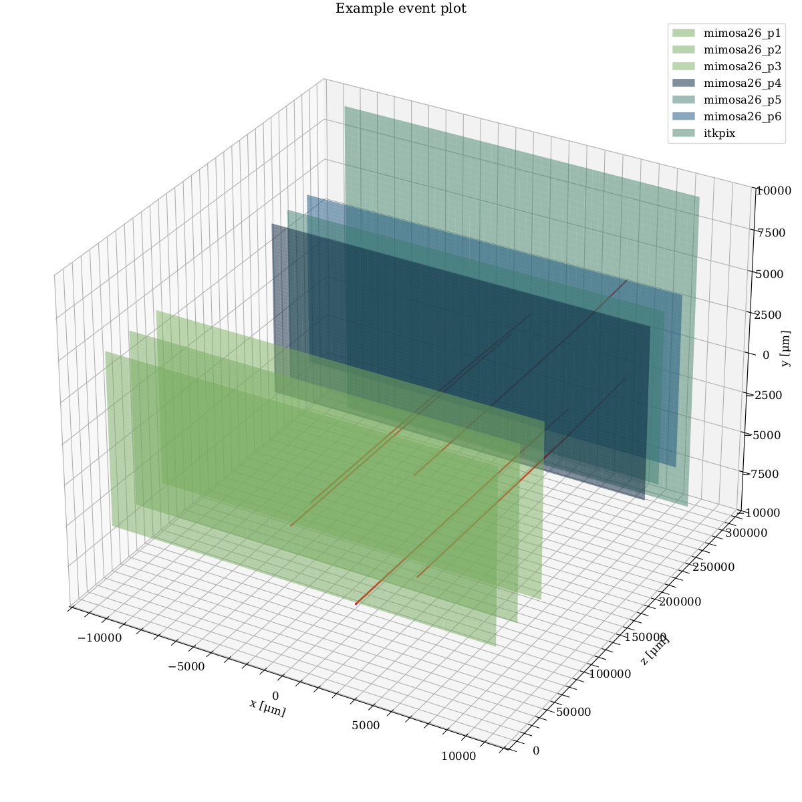

# pytestbeam
[](https://github.com/psf/black)

Python-based Monte Carlo simulation of a test beam setup. An EUDET-type beam telescope is implemented. The telescope consists of MIMOSA26 planes and an ITkPix as a time reference, but other devices can easily be added.
[Numba](https://numba.pydata.org/) allows for performant calculations, drastically reducing compilation time. Since the physics cases are greatly simplified, this repository serves primarily for demonstration purposes. For a more comprehensive simulation of test beam setups, take a look at[Allpix Squared](https://allpix-squared.docs.cern.ch/).

The particle beam consists of electrons with a given rate, beam profile, dispersion, angle, and total number of particles. Each particle loses energy according to a convolution of Landau and a Gaussian distribution and scatters according to a Gaussian distribution, with the width calculated using the Highlander formula. Scattering occurs at an infinitely thin sheet at the device surface, and there is no scattering in the air between the devices.

The devices have rectangular pixels and a mostly uniform material budget, and they are placed in the center of the beam, though they can be shifted off-center. The clusters are calculated by sampling a Gaussian distribution around the particle intersection point, with a width given by the Einstein diffusion formula. Each device can be either triggered or untriggered; this only affects part of the hit data collection, as each beam particle has a given chance to be triggered.



# Installation
**pytestbeam** requires [pylandau](https://github.com/SiLab-Bonn/pylandau), and this package runs for now only on Python version 3.10.

**pytestbeam** and all the requirements are installed with:
```bash
git clone https://github.com/rpartzsch/pytestbeam
cd pytestbeam
pip install -e .
```
# Usage
Create your test beam setup in setup.yml, and then execute the following command:
```bash
python pytestbeam.py
```
Materials are characterized in ```materials.yml```. To add, for example, an absorber to the setup, include a device with a single row and column of pixels made from the specified material in  ```setup.yml```.
The output data is saved in HDF5 format.
